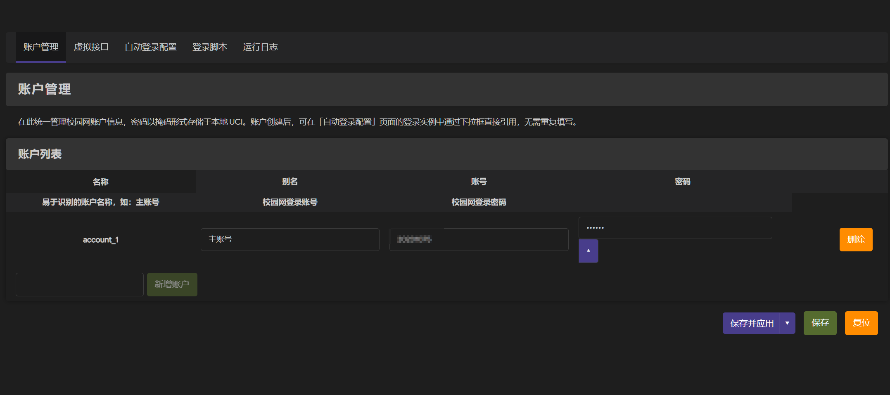
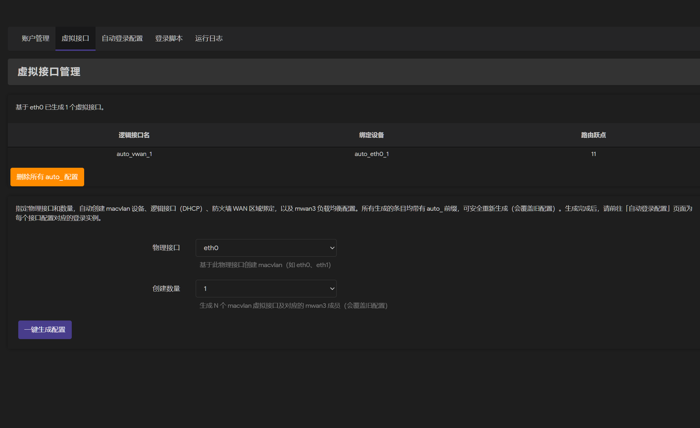
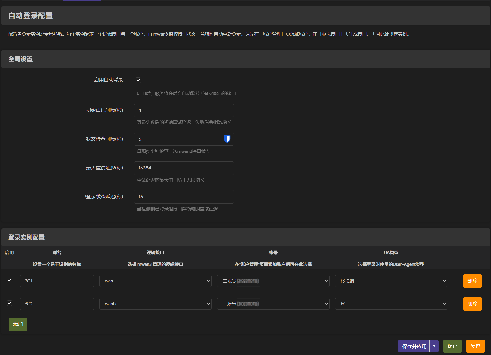
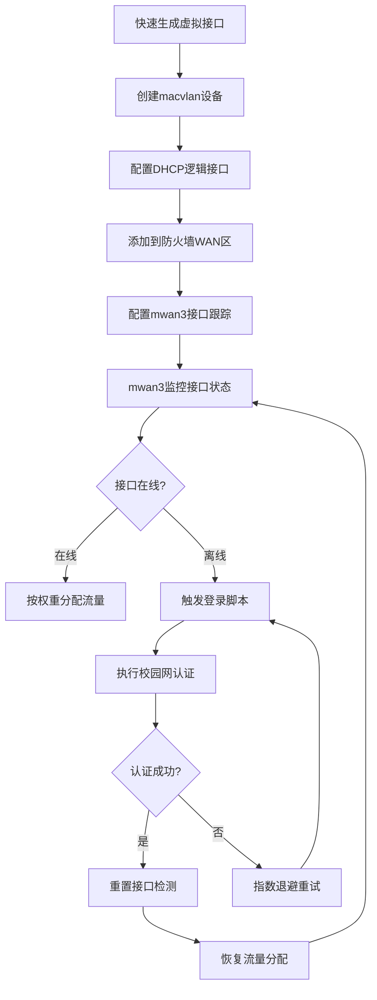

# LuCI App MultiLogin

OpenWrt/LEDE 多wan自动登录 LuCI 应用
适用于 OpenWrt 23.05+ 以及 mwan3 2.10+
## 功能特性





## 目录

- [版本变更](#版本变更)
- [原理](#原理)
- [依赖](#依赖)
- [安装](#安装)
  - [方法 1: 通过 opkg 安装（推荐）](#方法-1-通过-opkg-安装推荐)
  - [方法 2: 从源码编译](#方法-2-从源码编译)
- [配置说明](#配置说明)
  - [Web 界面配置](#web-界面配置)
  - [登录脚本返回码](#登录脚本返回码)
  - [命令行管理](#命令行管理)
- [故障排查](#故障排查)
  - [服务无法启动](#服务无法启动)
  - [登录失败](#登录失败)
  - [虚拟接口未生效](#虚拟接口未生效)
  - [修改配置后不生效](#修改配置后不生效)
  - [Web 界面无法访问](#web-界面无法访问)
- [自定义登录脚本](#自定义登录脚本)
- [许可证](#许可证)
- [贡献](#贡献)
- [致谢](#致谢)


### 核心功能
-  支持多个 WAN 口同时管理
-  自动监控 mwan3 接口状态
-  接口离线时自动尝试登录
-  支持 PC 和移动端 User-Agent 类型
-  失败重试机制（指数退避）
-  服务状态监控和控制

### 2.0 新特性
-  **现代化架构**：从 Lua CBI 重构为 JS + rpcd 架构
-  **虚拟接口快速生成**：一键创建 macvlan 设备，自动配置 network、firewall 和 mwan3
-  **账户统一管理**：集中管理账户信息，实例配置可直接引用
-  **模块化界面**：5 个独立页面，清晰的功能分离
-  **在线脚本编辑**：直接在 Web 界面编辑登录脚本
-  **实时日志查看**：无需 SSH，直接在界面查看运行日志
## 原理

本方案通过 mwan3 的接口状态监控能力与自定义脚本联动，实现智能流量调度和故障自愈。

### 工作流程



### 核心机制

1. **虚拟接口层**: 基于 macvlan 技术，在单个物理网卡上创建多个虚拟接口，每个接口获取独立的 MAC 地址和 IP
2. **网络配置层**: 每个虚拟接口配置为 DHCP 客户端，自动获取 IP 地址，并设置不同的路由跃点
3. **防火墙层**: 将所有虚拟接口加入 WAN 区域，实现统一的防火墙策略和 NAT 转换
4. **负载均衡层**: mwan3 监控所有接口健康状态（通过 ping 国内 DNS 服务器），根据权重分配流量
5. **故障自愈层**: 接口离线时，控制脚本自动调用登录脚本进行认证，成功后 mwan3 自动恢复该接口的流量分配

详细配置过程请见 [我的博客](https://blog.zesuy.top)。

## 依赖

- `mwan3` - 多 WAN 连接管理
- `curl` - HTTP 请求工具
- `bash` - Shell 脚本执行环境
- `luci-compat` - LuCI 兼容层
- `luci-app-mwan3` - mwan3 Web 界面（推荐，用于手动调整 mwan3 配置）

## 安装

### 方法 1: 通过 opkg 安装（推荐）

1.  将编译好的 `.ipk` 文件上传到路由器。
2.  安装软件包：
    ```bash
    opkg install luci-app-multilogin_*.ipk
    ```

### 方法 2: 从源码编译

1.  将 `luci-app-multilogin` 目录复制到 OpenWrt SDK 的 `package/` 目录。
2.  编译：
    ```bash
    make download -j8 V=s
    ./scripts/feeds update -a
    ./scripts/feeds install -a
    make toolchain/install -j$(nproc) V=s
    make package/luci-app-multilogin/compile V=s
    ```
3.  在 `bin/packages/...` 目录中找到生成的 ipk 文件并安装。

## 配置说明

### Web 界面配置

访问 LuCI 界面：`服务` -> `多拨自动登录`

插件提供 5 个功能页面，建议按以下顺序进行配置：

#### 1. 账户管理

统一管理校园网账户信息，避免重复配置。

- **别名**: 为账户设置易于识别的名称（如：主账号、备用账号）
- **账号**: 校园网登录账号
- **密码**: 校园网登录密码（以密文存储在本地 UCI）

配置完成后，其他页面可以通过下拉框直接引用这些账户。

#### 2. 虚拟接口管理

快速生成基于 macvlan 的虚拟接口，并自动配置 mwan3 负载均衡。

**当前配置状态**
- 显示已生成的所有 `auto_` 接口
- 包含逻辑接口名、绑定设备、路由跃点等信息
- 支持一键删除所有自动生成的配置

**快捷生成**
- **物理接口**: 选择基础物理网卡（如 eth0）
- **生成数量**: 设置要创建的虚拟接口数量（如 3 个）
- 点击"生成配置"后，系统将自动完成：
  - 创建 macvlan 虚拟设备（`auto_eth0_1`, `auto_eth0_2`, ...）
  - 创建 DHCP 逻辑接口（`auto_vwan_1`, `auto_vwan_2`, ...）
  - 添加到防火墙 WAN 区域
  - 配置 mwan3 接口跟踪（4 个国内 DNS 作为健康检测目标）
  - 配置 mwan3 成员和负载均衡策略
  - 自动分配路由跃点（11, 12, 13, ...）

> **注意**: 生成的接口均以 `auto_` 为前缀，重新生成会覆盖旧配置。配置完成后，请前往「自动登录配置」为每个接口创建登录实例。

#### 3. 自动登录配置

配置登录实例，将接口与账户绑定。

**全局设置**
- **启用自动登录**: 主开关，控制整个服务的启用/禁用
- **初始重试间隔**: 登录失败后的初始延迟时间（秒），默认 4 秒
- **状态检查间隔**: 检查 mwan3 接口状态的频率（秒），默认 5 秒
- **最大重试延迟**: 重试延迟的上限（秒），默认 16384 秒
- **已登录状态延迟**: 检测到已登录但接口离线时的延迟（秒），默认 16 秒

**登录实例配置**

每个实例绑定一个逻辑接口和一个账户：

- **启用**: 控制此实例是否启用
- **别名**: 为实例设置易于识别的名称（如：PC登录1）
- **逻辑接口**: 从下拉框选择 mwan3 管理的逻辑接口（自动读取 network 配置）
- **账号**: 从下拉框选择已在"账户管理"页面添加的账户
- **UA类型**: 选择 PC 或移动端 User-Agent

> **提示**: 如果下拉框中没有可选项，请先前往对应页面添加账户或生成接口。

#### 4. 登录脚本

在线编辑登录执行脚本 (`/etc/multilogin/login.sh`)。

- 提供代码编辑器，支持语法高亮
- 可根据不同校园网环境自定义登录逻辑
- 支持多登录模板切换（如虎溪校区、A区等）
- 修改后保存并重启服务生效

脚本接收参数：
- `--mwan3 <interface>`: 逻辑接口名
- `--account <username>`: 账号
- `--password <password>`: 密码
- `--ua-type <pc|mobile>`: UA类型

#### 5. 运行日志

实时查看服务运行日志。

- 显示最新的日志条目（从 `logread` 提取）
- 包含接口状态、登录尝试、成功/失败信息
- 支持刷新按钮更新日志
- 无需 SSH 登录路由器即可诊断问题

### 登录脚本返回码

`login.sh` 脚本应返回以下退出码：

- `0`: 登录成功
- `1`: 登录失败
- `2`: 已经登录（无需重复登录）
- `3`: 脚本错误
- `4+`: 其他错误

### 命令行管理

```bash
# 启动服务
/etc/init.d/multilogin start

# 停止服务
/etc/init.d/multilogin stop

# 重启服务
/etc/init.d/multilogin restart

# 查看服务状态
/etc/init.d/multilogin status

# 查看日志
logread | grep multi_login
```

## 故障排查

### 服务无法启动

1.  检查配置文件是否正确：
    ```bash
    uci show multilogin
    ```
2.  检查脚本是否存在：
    ```bash
    ls -l /etc/multilogin/
    ```
3.  确保脚本有执行权限：
    ```bash
    chmod +x /etc/multilogin/*.sh /etc/multilogin/*.bash
    ```
4.  查看系统日志：
    ```bash
    logread | grep multilogin
    ```
5.  检查 rpcd 是否正常运行：
    ```bash
    /etc/init.d/rpcd status
    /etc/init.d/rpcd restart
    ```

### 登录失败

1.  在 Web 界面查看「运行日志」页面，查找错误信息
2.  检查接口名称是否与 mwan3 中的名称一致：
    ```bash
    mwan3 interfaces
    uci show network | grep interface
    ```
3.  检查账号和密码是否正确（在「账户管理」页面）
4.  查看详细日志：
    ```bash
    logread -f | grep multi_login
    ```
5.  手动测试登录脚本：
    ```bash
    /etc/multilogin/login.sh \
      --mwan3 auto_vwan_1 \
      --account your_account \
      --password your_password \
      --ua-type pc
    ```

### 虚拟接口未生效

1.  检查 macvlan 设备是否创建成功：
    ```bash
    ip link show
    ```
2.  检查逻辑接口是否获取到 IP：
    ```bash
    ifstatus auto_vwan_1
    ```
3.  检查 mwan3 接口状态：
    ```bash
    mwan3 status
    ```
4.  如果配置混乱，可以在「虚拟接口」页面删除所有 `auto_` 配置重新生成

### 修改配置后不生效

1.  确保点击了"保存并应用"按钮
2.  手动重启相关服务：
    ```bash
    /etc/init.d/multilogin restart
    /etc/init.d/network reload
    /etc/init.d/mwan3 restart
    ```
3.  检查 UCI 配置是否已生效：
    ```bash
    uci changes
    uci commit
    ```

### Web 界面无法访问

1.  检查 LuCI 服务是否正常：
    ```bash
    /etc/init.d/uhttpd status
    /etc/init.d/uhttpd restart
    ```
2.  检查依赖包是否安装：
    ```bash
    opkg list-installed | grep luci-compat
    ```
3.  清除浏览器缓存后重新访问

## 自定义登录脚本

如果默认的 `login.sh` 不适合你的校园网环境，可以通过以下方式自定义：

1. **Web 界面编辑（推荐）**: 在 `服务` -> `多拨自动登录` -> `登录脚本` 页面直接编辑
2. **命令行编辑**: 
   ```bash
   vi /etc/multilogin/login.sh
   /etc/init.d/multilogin restart
   ```

### 脚本规范

登录脚本接收以下命令行参数：

```bash
/etc/multilogin/login.sh \
  --mwan3 <interface> \
  --account <username> \
  --password <password> \
  --ua-type <pc|mobile>
```

**必须返回以下退出码**：
- `0`: 登录成功
- `1`: 登录失败
- `2`: 已经登录（无需重复登录）
- `3`: 脚本错误
- `4+`: 其他错误

### 测试脚本

手动测试你的登录脚本：

```bash
/etc/multilogin/login.sh \
  --mwan3 auto_vwan_1 \
  --account your_account \
  --password your_password \
  --ua-type pc

echo "Exit code: $?"
```

## 许可证

本项目采用 [MIT 许可证](LICENSE)。

## 贡献

欢迎提交 Issue 和 Pull Request。

## 致谢

本项目参考了 [luci-app-nettask](https://github.com/lucikap/luci-app-nettask) 的实现方式。
